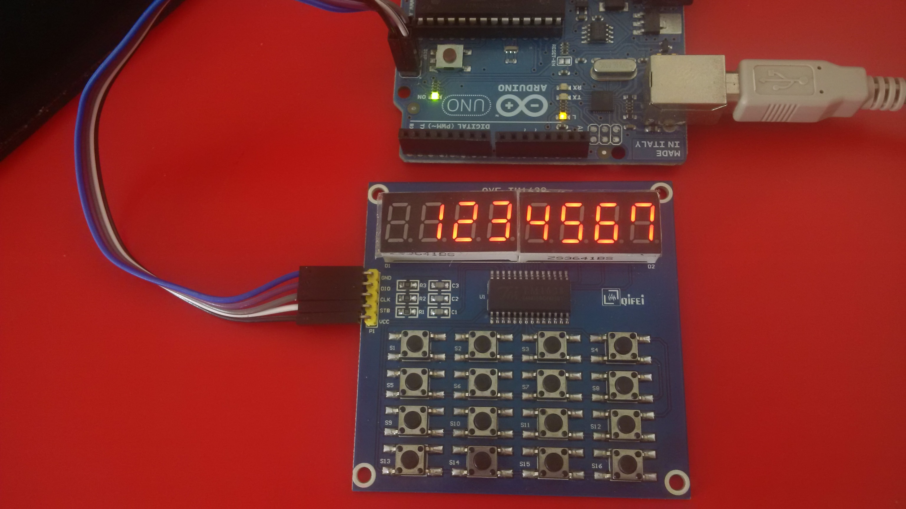
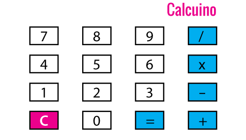

Calcuino
========

Hardware je popsán v článku [Calcuino](https://retrocip.cz/calcuino-1/). Jednotlivé adresáře obsahuijí různé verze firmware. Přiložena je i použitá zobrazovací knihovna.

3D model pro krabičku na klávesnici naleznete zde: [Krabička pro Calcuino](https://retrocip.cz/krabicka-pro-calcuino/)

Foto
----

Klávesnice
----

