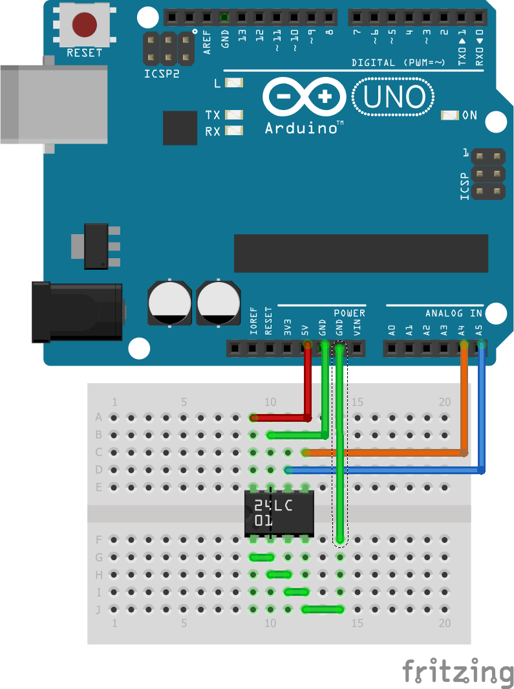

Práce s EEPROM (+errata)
========================

_V knize je omylem vytisknutá stará verze zdrojového kódu, správně má být místo funkcí Wire.send a Wire.receive použit zápis Wire.write a Wire.read. Za chybu se omlouvám._

Schéma
------

